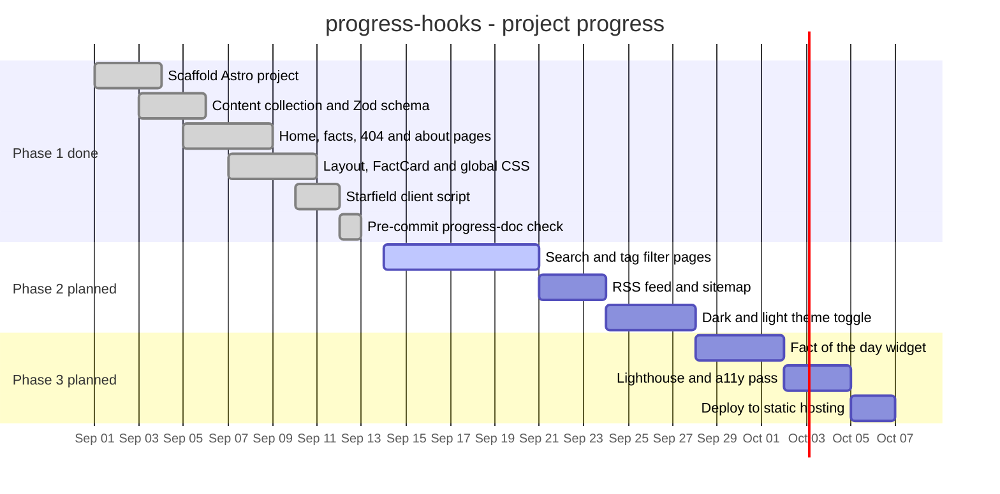
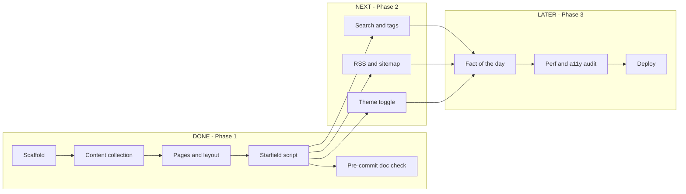

# Progress Indicator — progress-hooks

> Demo/educational document, and the heart of this repo's purpose: it tracks
> what has been built so far in this sample Astro project and what sample
> tasks are planned for the next phases. AI agents keep it updated on every
> commit (see `AGENTS.md` and the pre-commit hook in `.githooks/`).
> Render this file in any Mermaid-capable viewer (GitHub, GitLab, VS Code, etc.)
> to see the diagrams.

---

## Phase 1 — Foundation (done ✅)

- Sample site: **Stellar Facts**, a tiny Astro 7 site with bite-sized facts
  about space — the demo payload this tooling runs against.
- Content collection `facts` defined in `src/content.config.ts` with a Zod schema
  (title, tagline, summary, date, wow 0–100, tags).
- 8 markdown facts published under `src/data/facts/*.md`.
- Pages: home (`src/pages/index.astro`), facts index, dynamic fact page
  (`src/pages/facts/[...slug].astro`), about, and a custom 404.
- Shared `BaseLayout.astro` with header/nav/footer and `FactCard.astro` component.
- Global theme in `src/styles/global.css` plus scoped styles.
- Single client-side script: animated canvas starfield (`src/scripts/stars.js`).
- Progress-doc automation: `AGENTS.md` instructs AI agents to keep this
  document updated, and a deterministic pre-commit hook (`.githooks/`, wired
  via the npm `prepare` script) rejects code commits without a doc update.

## Phase 2 — Next phases (planned 🚧)

See the **Sample Backlog** below for the concrete demo tasks. The gantt chart
shows the rough timeline: everything before "today" is shipped work; everything
after is the planned Phase 2/3 work.

---

## Gantt: done vs. upcoming

---

## Flow: phases overview

---

## Sample Backlog (demo tasks)

Tasks created for demonstration/educational purposes on this project:

| #  | Task                          | Description (sample)                                                        | Target file(s)                                  |
| -- | ----------------------------- | --------------------------------------------------------------------------- | ----------------------------------------------- |
| T1 | Tag filter page               | Add `/facts/tags/[tag].astro` listing facts per tag using the collection.   | `src/pages/facts/tags/[tag].astro`              |
| T2 | RSS feed + sitemap            | Generate an RSS feed for the facts collection and a sitemap for the build.  | `src/pages/rss.xml.js`                          |
| T3 | Dark/light theme toggle       | Small client-side toggle persisting the choice in `localStorage`.           | `src/components/ThemeToggle.astro`              |
| T4 | Wow-score filter in UI        | Sort/filter the facts list by the `wow` frontmatter value (e.g. top 🔥).    | `src/pages/facts/index.astro`                   |
| T5 | Fact-of-the-day widget        | Pick one fact per day (date-seeded) and feature it on the homepage.         | `src/pages/index.astro`                         |
| T6 | Lighthouse + a11y pass        | Check contrast, focus states, and reduced-motion for the starfield canvas.  | `src/scripts/stars.js`, `src/styles/global.css` |
| T7 | Deploy to static hosting      | Wire the `dist/` build output to a static host of choice.                   | CI config / hosting dashboard                   |

> These tasks are intentionally lightweight — they exist to demonstrate how a
> backlog and a progress graph work together, not as a real roadmap.
